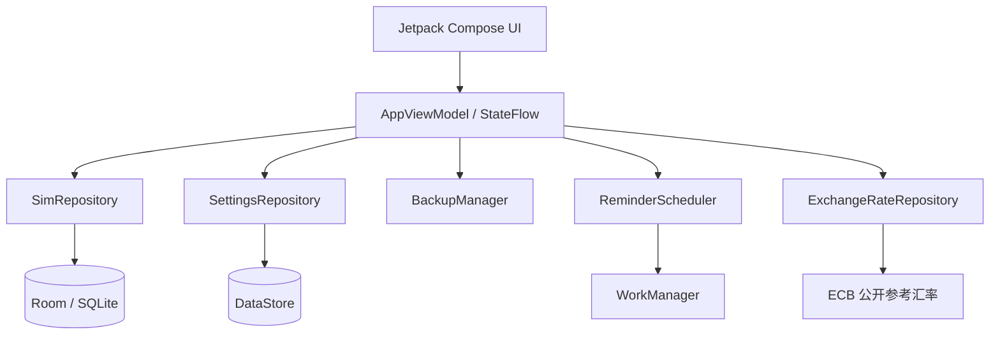

<div align="center">
  <h1>OmniSIM</h1>
  <p><strong>SIM 与 eSIM 续费管理器</strong></p>
  <p>为多张 SIM 统一管理续费、充值与保号日期。轻量、本地优先，无需账号。</p>
  <p><strong>简体中文</strong> · <a href="README_EN.md">English</a></p>
  <p>
    <a href="https://github.com/mibgb65-cloud/OmniSIM/releases/latest"></a>
    <a href="https://github.com/mibgb65-cloud/OmniSIM/actions/workflows/release.yml"></a>
    
    
    <a href="LICENSE"></a>
  </p>
  <p>
    <a href="https://github.com/mibgb65-cloud/OmniSIM/releases/latest">下载最新版本</a> ·
    <a href="https://github.com/mibgb65-cloud/OmniSIM/releases">查看发布记录</a> ·
    <a href="https://github.com/mibgb65-cloud/OmniSIM/issues">提交问题</a>
  </p>
</div>

> [!NOTE]
> OmniSIM 以本地存储为核心。手机号码、SIM 信息、续费日期和备注保存在你的
> Android 设备上，不需要账号，也不会上传到远程服务器。

> [!IMPORTANT]
> GitHub Release 当前提供的是**未签名 APK**，用于验证和后续签名流程。安装或正式
> 分发前，必须使用你自己的发布密钥签名。

## 项目定位

OmniSIM 面向需要管理少量 SIM/eSIM 的个人用户，专注回答三个问题：

1. 我有哪些 SIM？
2. 哪张 SIM 最快需要续费？
3. 完成续费后，下一个续费日期是什么时候？

核心流程保持简单：

```text
打开应用 → 查看最近续费 → 选择 SIM → 在运营商渠道完成续费
        → 标记为已续费 → 确认实际日期 → 保存历史并重新安排提醒
```

## 功能概览

| 范围 | 能力 |
| --- | --- |
| 续费管理 | 按日期排序、逾期/今日到期/即将到期状态、30–365 天预设及自定义周期 |
| SIM 档案 | 名称、运营商、国家/地区、号码、类型、套餐、续费网址和备注 |
| 续费操作 | 根据实际续费日期计算下次日期，允许修改后确认，事务性保存历史 |
| 历史记录 | 单卡续费历史和可按 SIM、时间范围筛选的全局时间轴 |
| 提醒 | WorkManager 近似每日检查、多个提醒偏移量、通知去重、续费后重新调度 |
| 成本 | 记录金额与币种，使用欧洲中央银行参考汇率估算统一货币总成本 |
| 数据 | Room 本地数据库、DataStore 设置、版本化 JSON 备份与事务性恢复 |
| 外观 | 跟随系统/浅色/深色主题、可选 Material You、简体中文和英语 |
| 隐私 | 默认隐藏部分号码，无分析、遥测、广告、账号或远程日志 |

## 界面预览

正式截图将在准备好不包含测试号码、通知浮层和设备状态栏干扰的素材后加入。

| 首页 | SIM 列表 | 设置 |
| :---: | :---: | :---: |
| 最近续费与时间轴 | 搜索、状态筛选与档案 | 外观、提醒、隐私与数据 |

## 隐私与权限

核心 SIM 管理、续费历史、提醒和备份功能均可离线工作。

| 项目 | 行为 |
| --- | --- |
| 本地数据 | 手机号码、SIM 信息、日期、价格和备注仅保存在设备本地 |
| 网络访问 | 仅获取欧洲中央银行公开的每日参考汇率，或由用户主动打开续费网站 |
| 汇率请求 | 不携带 SIM 数据、手机号码、价格或续费日期，并使用本地缓存回退 |
| 数据收集 | 不包含分析、遥测、广告、崩溃上报或远程日志 |
| 账号与云端 | 不提供账号、登录、云同步或后端服务 |

应用仅声明必要权限：

| 权限 | 用途 |
| --- | --- |
| `POST_NOTIFICATIONS` | Android 13+ 在用户主动启用提醒后请求续费通知权限 |
| `INTERNET` | 下载欧洲中央银行公开的参考汇率数据 |

续费网址通过外部浏览器打开，不需要应用直接访问网站内容。

OmniSIM 不请求联系人、短信、电话、通话记录、位置、相机、麦克风或广泛存储权限。

## 技术栈

- Kotlin 2.3.21、Jetpack Compose、Material 3
- Navigation Compose、不可变 `StateFlow` UI 状态
- Room/SQLite、DataStore Preferences
- Coroutines、Flow、WorkManager、Android 通知 API
- Kotlin Serialization、Android Storage Access Framework
- 最低 Android 6.0（API 23），目标 Android API 36

## 架构



项目使用轻量应用容器组织依赖，不引入额外的依赖注入框架。

### 数据模型

| 表 | 说明 |
| --- | --- |
| `sims` | SIM 身份信息、续费配置和归档状态 |
| `renewal_history` | 实际续费日期、前后日期、金额、币种和备注；随 SIM 级联删除 |
| `reminder_state` | `SIM + 续费日期 + 提醒偏移量` 唯一通知记录 |

续费截止日期使用 `LocalDate`，创建和更新时间等元数据使用 `Instant`，避免时区变化
导致日历日期偏移。

## 快速开始

### 环境要求

- Android Studio，或 Android SDK API 36 与 Build Tools 35.0.0+
- JDK 17+
- Git

### 获取源码

```bash
git clone https://github.com/mibgb65-cloud/OmniSIM.git
cd OmniSIM
```

### 构建 Debug APK

Windows PowerShell：

```powershell
.\gradlew.bat assembleDebug
```

macOS 或 Linux：

```bash
./gradlew assembleDebug
```

产物位于 `app/build/outputs/apk/debug/app-debug.apk`。

### 测试与静态检查

```powershell
.\gradlew.bat assembleDebug test lint
```

单元测试覆盖日期计算、状态优先级、提醒匹配与去重、汇率解析、成本换算、备份校验
和续费历史筛选。

## 备份与恢复

“设置 → 数据”通过 Android 文档选择器导出或导入 JSON，无需广泛存储权限。备份包含
`backupVersion`、SIM、续费历史和相关设置。

恢复前会完整校验 ID、引用关系、日期、必填值、金额和安全的 HTTP(S) 链接；数据库
替换在 Room 事务中完成，无效输入不会修改现有数据。

## 通知行为

OmniSIM 使用单个省电的周期性 WorkManager 任务，默认支持提前 30、14、7、3、1、
0 天及已逾期提醒。通知使用 `SIM ID + 续费日期 + 偏移量` 去重，续费后会清理旧状态
并重新调度。

WorkManager 的执行时间是近似的。Doze、省电模式、应用待机和厂商电池策略可能延迟
后台任务，因此提醒不保证在某个精确时刻送达。

## 自动发布

推送与 `versionName` 一致的语义化版本标签，会触发
[Release workflow](.github/workflows/release.yml)：

```bash
# 先更新 app/build.gradle.kts 中的 versionCode 和 versionName
git tag v1.0.1
git push origin v1.0.1
```

工作流会：

1. 校验标签与应用版本。
2. 执行测试和 Lint。
3. 通过 R8 构建 Release APK。
4. 验证 APK 未签名并生成 SHA-256。
5. 创建 GitHub Release 并上传两个文件。

发布产物命名为 `OmniSIM-<version>-release-unsigned.apk`。

## 参与贡献

欢迎提交 [Issue](https://github.com/mibgb65-cloud/OmniSIM/issues) 和范围明确的 Pull
Request。请保持修改聚焦于轻量、私密、本地优先的 SIM 续费管理体验。

提交前请运行：

```powershell
.\gradlew.bat assembleDebug test lint
```

请勿引入分析、广告、账号系统、云同步或不必要的权限和依赖。

## 许可证

OmniSIM 使用 [MIT License](LICENSE) 发布。

<div align="center">
  <strong>Never miss a SIM renewal again.</strong>
</div>
