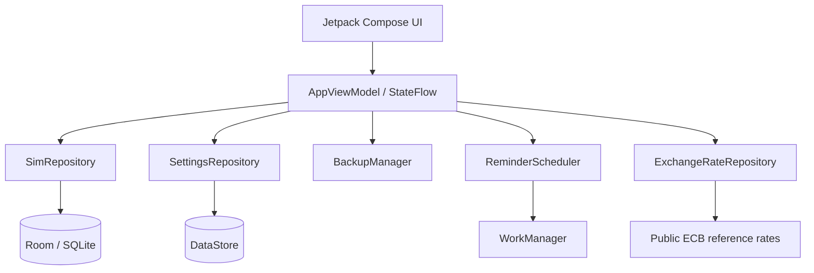

<div align="center">
  <h1>OmniSIM</h1>
  <p><strong>SIM &amp; eSIM Renewal Manager</strong></p>
  <p>Keep renewal, recharge, and keep-alive dates for multiple SIMs in one place.<br>Lightweight, local-first, and account-free.</p>
  <p><a href="README.md">简体中文</a> · <strong>English</strong></p>
  <p>
    <a href="https://github.com/mibgb65-cloud/OmniSIM/releases/latest"></a>
    <a href="https://github.com/mibgb65-cloud/OmniSIM/actions/workflows/release.yml"></a>
    
    
    <a href="LICENSE"></a>
  </p>
  <p>
    <a href="https://github.com/mibgb65-cloud/OmniSIM/releases/latest">Download latest release</a> ·
    <a href="https://github.com/mibgb65-cloud/OmniSIM/releases">Release history</a> ·
    <a href="https://github.com/mibgb65-cloud/OmniSIM/issues">Report an issue</a>
  </p>
</div>

> [!NOTE]
> OmniSIM is local-first. Phone numbers, SIM information, renewal dates, and notes
> stay on your Android device. No account is required, and SIM data is not uploaded
> to a remote server.

> [!IMPORTANT]
> GitHub Releases provide an APK signed with OmniSIM's long-term release
> certificate. It can be installed directly and used for in-place updates. Android
> may still ask for permission to install unknown apps when sideloading from GitHub.

## Purpose

OmniSIM is designed for one person managing a small number of SIMs and eSIMs. It
focuses on answering three questions:

1. What SIMs do I have?
2. Which SIM needs attention next?
3. After renewal, when is the next renewal?

The primary flow stays intentionally short:

```text
Open → See the nearest renewal → Select a SIM → Renew through the carrier
     → Mark as renewed → Confirm the actual date → Save history and reschedule reminders
```

## Features

| Area | Capabilities |
| --- | --- |
| Renewal tracking | Date-sorted records, overdue/due-today/due-soon states, 30–365 day presets, and custom cycles |
| SIM profiles | Name, carrier, country/region, number, type, plan, renewal URL, and notes |
| Renewal flow | Calculate from the actual renewal date, allow an override, and save history transactionally |
| History | Per-SIM history plus a global timeline filterable by SIM and time range |
| Reminders | Approximate daily WorkManager checks, multiple offsets, deduplication, and renewal rescheduling |
| Cost | Store amount and currency; estimate a combined total using ECB reference rates |
| Data | Local Room database, DataStore settings, versioned JSON backup, and transactional restore |
| Appearance | System/light/dark themes, optional Material You, Simplified Chinese, and English |
| Privacy | Phone masking by default; no analytics, telemetry, advertising, accounts, or remote logging |

## Preview

Product screenshots will be added after a clean, anonymized capture set is ready,
without test phone numbers, notification overlays, or distracting system UI.

| Home | SIM list | Settings |
| :---: | :---: | :---: |
| Nearest renewal and timeline | Search, status filters, and profiles | Appearance, reminders, privacy, and data |

## Privacy and permissions

Core SIM management, renewal history, reminders, and backup work offline.

| Topic | Behavior |
| --- | --- |
| Local data | Phone numbers, SIM details, dates, prices, and notes remain on the device |
| Network access | Used only for public ECB reference rates or a renewal website opened by the user |
| Rate requests | Never include SIM data, phone numbers, prices, or renewal dates; cached rates provide fallback |
| Data collection | No analytics, telemetry, advertising, crash reporting, or remote logging |
| Accounts and cloud | No accounts, login, cloud sync, or backend service |

The app declares only the permissions it needs:

| Permission | Purpose |
| --- | --- |
| `POST_NOTIFICATIONS` | Renewal notifications on Android 13+, requested only after the user enables reminders |
| `INTERNET` | Download public European Central Bank reference-rate data |

Renewal URLs are handed to an external browser; the app does not fetch their content.

OmniSIM does not request contacts, SMS, phone, call-log, location, camera,
microphone, or broad storage access.

## Technology

- Kotlin 2.3.21, Jetpack Compose, and Material 3
- Navigation Compose and immutable `StateFlow` UI state
- Room/SQLite and DataStore Preferences
- Coroutines, Flow, WorkManager, and Android notification APIs
- Kotlin Serialization and Android Storage Access Framework
- Minimum Android 6.0 (API 23), target Android API 36

## Architecture



A small application container wires dependencies together without an additional
dependency-injection framework.

### Data model

| Table | Purpose |
| --- | --- |
| `sims` | SIM identity, renewal configuration, and archive state |
| `renewal_history` | Actual and previous/next dates, amount, currency, and notes; cascade-owned by a SIM |
| `reminder_state` | Unique `SIM + renewal date + reminder offset` notification records |

Renewal deadlines use `LocalDate`; creation and update metadata use `Instant` to
avoid timezone shifts in calendar dates.

## Quick start

### Requirements

- Android Studio, or Android SDK API 36 with Build Tools 35.0.0+
- JDK 17+
- Git

### Get the source

```bash
git clone https://github.com/mibgb65-cloud/OmniSIM.git
cd OmniSIM
```

### Build a debug APK

Windows PowerShell:

```powershell
.\gradlew.bat assembleDebug
```

macOS or Linux:

```bash
./gradlew assembleDebug
```

The APK is written to `app/build/outputs/apk/debug/app-debug.apk`.

### Test and lint

```powershell
.\gradlew.bat assembleDebug test lint
```

Unit tests cover date calculations, status precedence, reminder matching and
deduplication, rate parsing, cost conversion, backup validation, and history filters.

## Backup and restore

Settings → Data exports and imports JSON through Android's document picker, without
broad storage permission. Backups contain a `backupVersion`, SIMs, renewal history,
and relevant settings.

Before confirmation, OmniSIM validates IDs, references, dates, required values,
amounts, and safe HTTP(S) links. Database replacement runs in a Room transaction;
invalid input leaves existing data unchanged.

## Notification behavior

OmniSIM schedules one battery-friendly periodic WorkManager task. Default offsets
are 30, 14, 7, 3, 1, and 0 days plus overdue. Notifications are deduplicated with
`SIM ID + renewal date + offset`; renewal clears obsolete state and reschedules work.

WorkManager timing is approximate. Doze, battery saver, app standby, and
manufacturer battery policies may delay background work, so reminders are not
guaranteed at an exact time.

## Automated releases

Pushing a semantic version tag matching `versionName` triggers the
[release workflow](.github/workflows/release.yml):

```bash
# First update versionCode and versionName in app/build.gradle.kts
git tag v1.0.1
git push origin v1.0.1
```

The workflow:

1. Validates the tag against the app version.
2. Runs tests and lint.
3. Builds the R8 release APK.
4. Verifies the APK signing certificate and generates a SHA-256 checksum.
5. Creates a GitHub Release and uploads both files.

The release key is injected through encrypted GitHub Actions Secrets and never
enters source control or build logs. Assets are named
`OmniSIM-<version>-release.apk`.

Release certificate SHA-256:

```text
58146fc8f47be9fc5729f9c149dc8f17877a646692bb23c4f8130a2232d441cb
```

## Contributing

Focused [issues](https://github.com/mibgb65-cloud/OmniSIM/issues) and pull requests
are welcome. Keep changes aligned with a lightweight, private, local-first renewal
manager for a small personal SIM collection.

Before submitting a change, run:

```powershell
.\gradlew.bat assembleDebug test lint
```

Do not introduce analytics, advertising, account systems, cloud sync, or unnecessary
permissions and dependencies.

## License

OmniSIM is released under the [MIT License](LICENSE).

<div align="center">
  <strong>Never miss a SIM renewal again.</strong>
</div>
